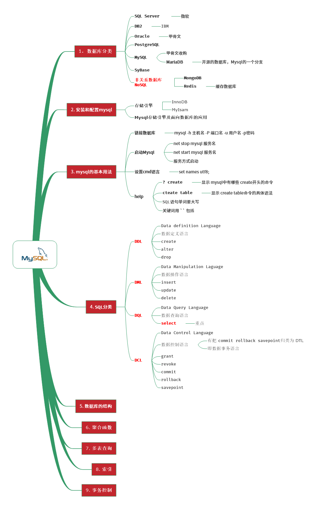
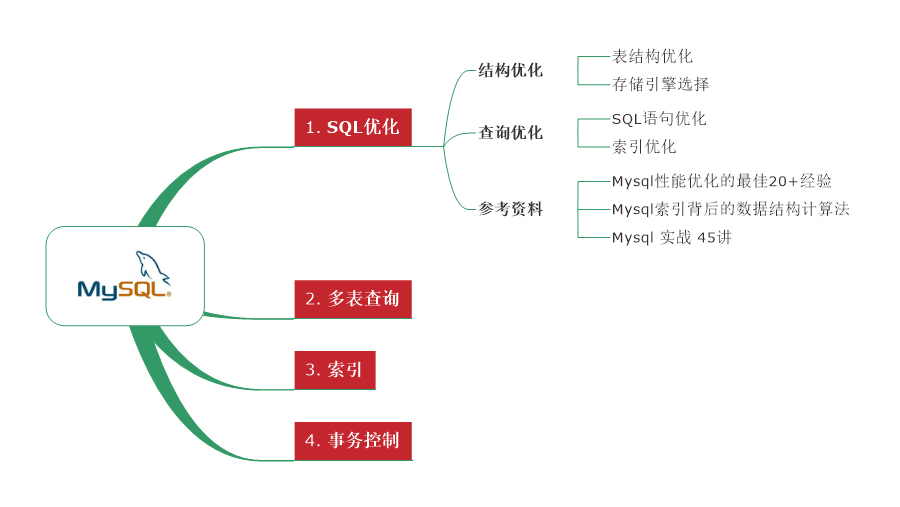

# PHP
	```
	Redis
	ElasticSearch
	High availability 高可用
	高并发
	Message Queue 消息队列

	全文检索
		coreseek shpinx
		xunsearch 迅搜技术

	dll 反编译
	php .dll 动态文件编写
      + 封装私有函数，不让别人看到代码
      + .dll 文件反编译
      
      2017年7月25日16:30:21 学习第一天
	```


程序员的实践精神


# 2 Mysql
  关系型数据库
  非关系型数据库
  结构数据库
  时序数据库等将得到越来越广泛的应用
    在不远的将来，以云为基础的云数据库将越来越多的影响人们的生活


## 1 数据库基础
1. [创建数据库 database.sql](1.创建数据库/database.sql)
  字符集，排序规则
  存储引擎 show engines;
  修改数据库，恢复数据库，显示数据库
  显示数据库的创建

2. [创建表 table.sql](2.创建表/table.sql)
  字符集，校对对着，引擎
  表的约束，主键，外键，唯一性，注释
  修改表名，字段名，数据类型，字段排列位置
  添加字段，删除字段，备份表
  创建海量数据

3. 数据类型
  * 整数类型
  * 浮点数类型
  * 日期和时间
  * 字符串

4. Mysql函数
  * 时间日期函数
  * 字符串函数
  * 数学函数
  * 流程控制函数
  * 其他函数

5. 数据库的 CRUD

6. [SELECT 语句, 参照 select.sql](select.sql)

7. Select 复杂查询
  * 多表查询
  * 子查询
    from子句中使用子查询，子查询看作是一个临时表，要有别名 alias
  * 合并查询 union & union all
  * 内连接 inner join ... on
  * 外连接
    左外连接 left join ... on ...
    右外连接 right join ... on ...

8. 表的约束

9. 索引

10. 事务

11. 视图

12. 用户管理


## 2 数据库优化
数据库的原则：能不链，就不要连接数据库，因为数据库链接是最吃力的
    - 缓存产品， redis， memerycache，读写分离，静态化，为啥这么做呢？


## 高性能数据库
	* 读写分离
  * 分库分表
  * 高并发系统
  * 分布式事务解决方案，实现简单并快速的事务提交与回滚

  https://github.com/doocs/advanced-java


## 2.1 Mysql 知识体系



## 2.2 高性能的 Mysql



## 2.3 高可用的 Mysql


